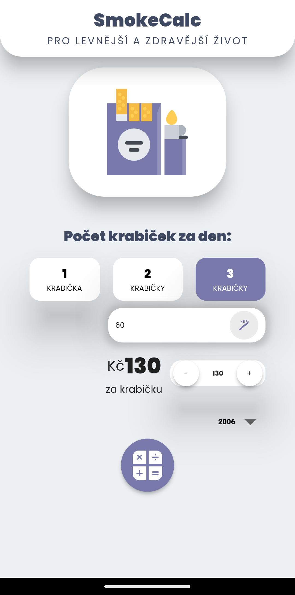
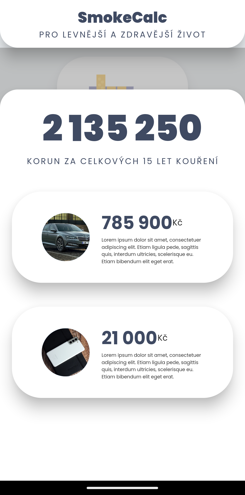
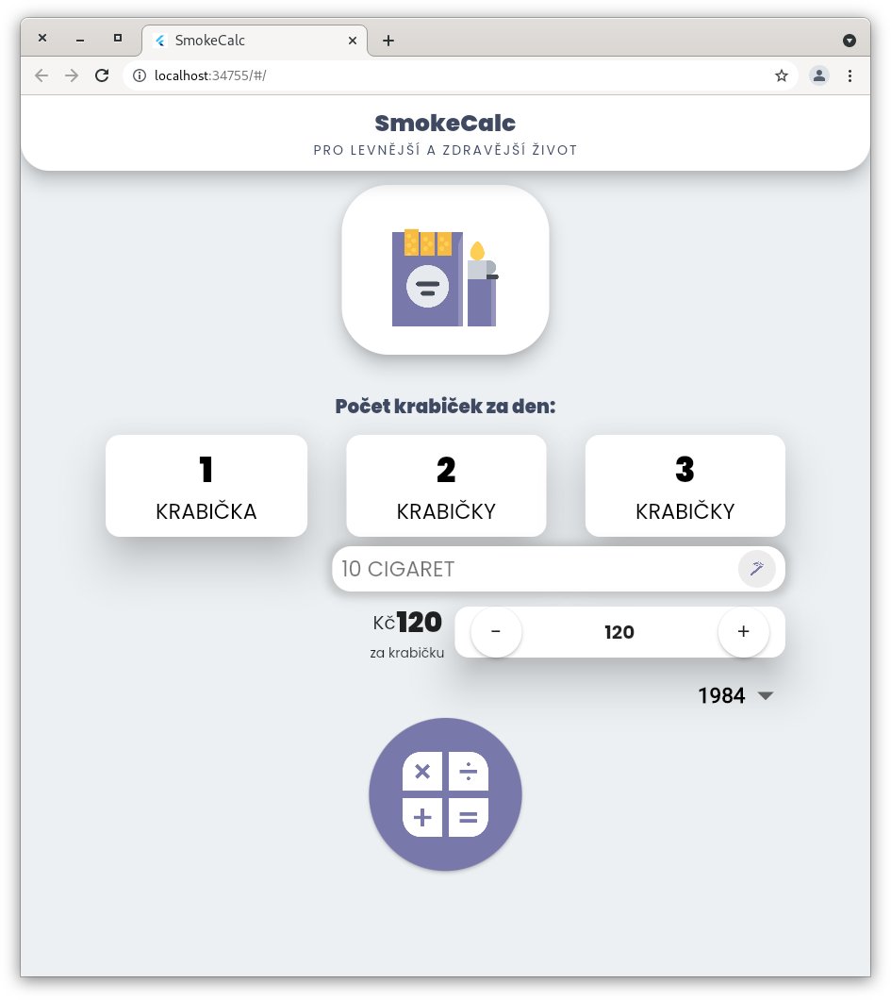

# SmokeCalc

### Pro levnější a zdravější život

Cvičná aplikace ve Frameworku Flutter a jazyku Dart 2.

Tvořeno dle návrhu v Neumorphism stylu sesmoleného během dvou hodin PVA, demo vytvořeno během čtvrtka a pátka :D

  
   

  
